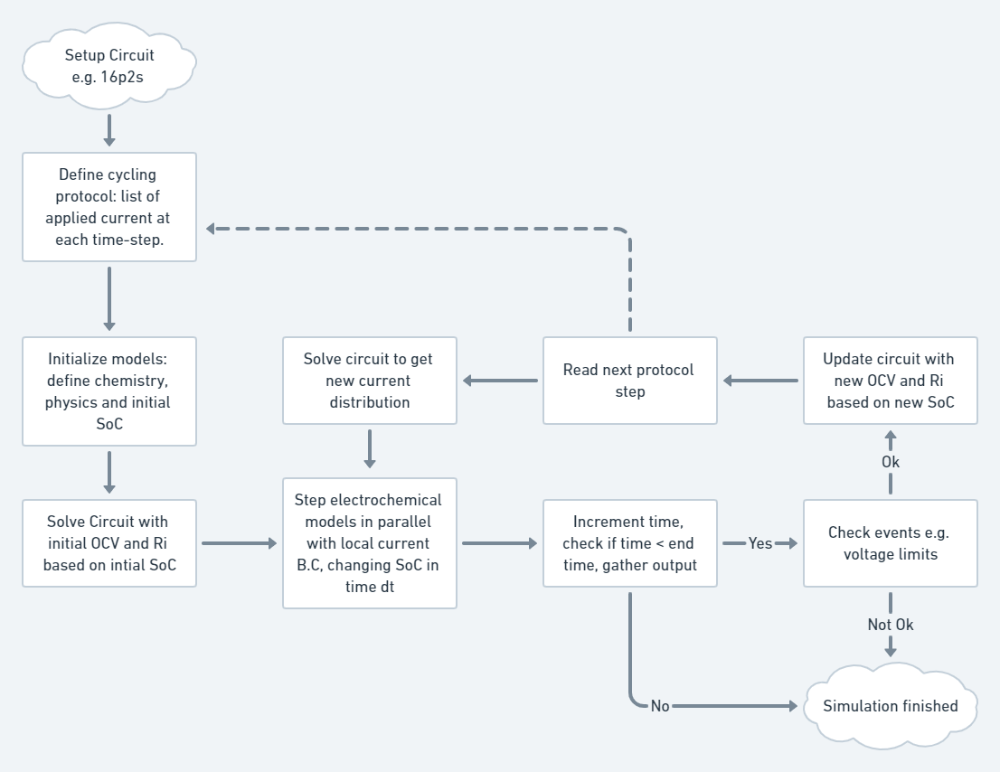
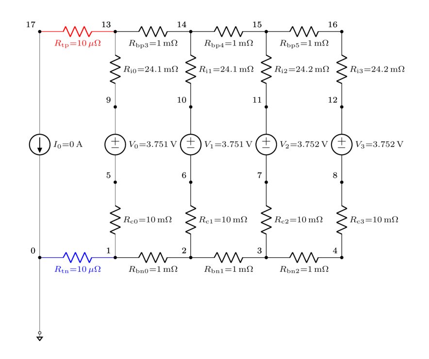

# Summary

Electrification of transport and other energy intensive activities is of growing importance as it provides an underpinning method to reduce carbon emissions. With an increase in reliance on renewable sources of energy and a reduction in the use of more predictable fossil fuels in both stationary and mobile applications, energy storage will play a pivotal role and batteries are currently the most widely adopted and versatile form. Therefore, understanding how batteries work, how they degrade and how to optimize and manage their operation at large scales is critical to achieving emission reduction targets. The electric vehicle (EV) industry requires a considerable number of batteries even for a single vehicle, sometimes numbering in the thousands if smaller cells are used, and the dynamics and degradation of these systems, as well as large stationary power systems, is not that well understood. As increases in the efficiency of a single battery become diminishing for standard commercially available chemistries, gains made at the system level become more important and can potentially be realised more quickly compared with developing new chemistries. Mathematical models and simulations provide a way to address these challenging questions and can aid the engineer and designers of batteries and battery management systems to provide longer lasting and more efficient energy storage systems.

# Statement of need

`liionpack` is a PyBaMM-affiliated Python package for simulating large systems of batteries connected in series and parallel. Python enables wrapping low-level languages (e.g., C) for speed without losing flexibility or ease-of-use in the user-interface. `liionpack` was designed to be used by physicists, engineers, students, academics and industrial researchers and system designers concerned with the dynamics of electric current and heat transport in large battery systems. Commercial battery pack simulation tools are available such as modules that can be included within Comsol&reg;, Simulink&reg; and STAR-CCM+&trade;, but to our knowledge `liionpack` is the first to be released open-source. The commercial packages contain more advanced features such as GUI's for circuit design, and integration with CAD based thermal and fluid dynamics tools, but `liionpack` provides everything you need to model a pack of batteries with simple physics and can incorporate circuit definitions defined elsewhere and heat transfer coefficients that are calculated elsewhere. We hope that it will provide the battery community with a platform to build upon to add more features in the future and increase productivity, reproducibility and transparency in this research space.

The API for `liionpack` was designed to provide a simple and efficient extension to the `PyBaMM` [@pybamm] framework allowing users to scale up simulations from single cells to many thousands with a few extra lines of code. `PyBaMM` provides a number of classic physics-based single battery models with configurable options to investigate thermal effects and degradation, for example. The pack architecture introduced by `liionpack` can be defined as a number of batteries connected in series and parallel to one another using busbars and interconnections with defined resistances. A netlist may also be used to construct the pack which is more flexible and allows for configurable network topology and can be constructed graphically with packages such as `LTSpice` [@ltspice] or simply created manually, specifying nodal connections as either current sources, voltage sources or resistors. Statistical distributions can be easily incorporated into the pack architecture elements through the use of input parameters that allow a single model to be solved with varying inputs.

# Algorithm

The algorithm to solve the coupled system of batteries is shown in \autoref{fig:0}. The nature of the solving process facilitates parallel processing of the electrochemical problem for each battery during each time-step formulated as an integrable 1D DAE. The system is coupled electrically at the global level via the busbars and interconnections in the circuit and solving this linear algebraic system between electrochemical time-steps determines the current balance and boundary conditions for each battery at the next time-step. The combination of a global circuit solve and local electrochemical solve repeatedly iterated over in time in a see-saw fashion provides the most simple and efficient way of coupling the system without repeating time-steps. Results for solving a single battery forming a circuit with negligible busbar resistance deviates by less than 0.01% from a pure `PyBaMM` simulation.



At present, the circuits that are solved may only contain three different types of element: namely current sources, voltage sources and resistors. Resistors are used to represent the busbars and interconnections in the pack as well as the internal resistance of the batteries. The open circuit voltage is used for the voltage sources in the circuit and modified nodal analysis (MNA) [@mna] is used to solve the circuit problem determining the distribution of current in the pack. A typical 4p1s pack architecture is shown below in \autoref{fig:1} which was produced using `Lcapy` [@lcapy].



Presently, the thermal problem is solved in a non-coupled way with each battery acting as an independent heat source and interacting with it's environment in a "lumped" sense with a volume-averaged heat transfer coefficient. Heat generation and conduction through the busbars and from cell to neighbouring cells is likely to occur in some scenarios and can be accounted for by solving a transient thermal problem on the network architecture [@jellyroll], which will be implemented in future releases. Heat transfer coefficients may also be easily adjusted on a cell-by-cell basis and also throughout the simulation solving process to reflect heterogenous and time-dependent cooling conditions.

Several distributed solvers are provided and can be selected through a common function with a simple function argument. These are `Casadi` [@casadi] which uses multi-threading and works well for single workstations and `ray` [@ray] and `dask` [@dask] which are designed for running on clusters and use multi-processing. Many of the functions and models that can be found in `PyBaMM` should work in exactly the same way in `liionpack` and examples are provided showing how to set up and configure different battery models for running in the pack system. Several visualization tools are also provided for analysis of the results.

# Example

An example of a small pack is included below. A 4p1s configuration is defined with busbar resistance of 1 $m\Omega$ and interconnection resistance of 10 $m\Omega$. The `Chen2020` [@Chen2020] parameter set is used to define the battery cell chemistry which was gathered using an LG M50 cylindrical cell of 21700 format. By default the single particle model `SPM` is used to define the electrochemical battery model system but a suite of others are available [@Marquis2020] and can be configured using a custom simulation.

```
import liionpack as lp
import pybamm

# Generate the netlist
netlist = lp.setup_circuit(Np=4, Ns=1, Rb=1e-3, Rc=1e-2)

# Define some additional variables to output
output_variables = [
    'X-averaged negative particle surface concentration [mol.m-3]',
    'X-averaged positive particle surface concentration [mol.m-3]',
]

# Cycling experiment, using PyBaMM
experiment = pybamm.Experiment([
    "Charge at 5 A for 30 minutes",
    "Rest for 15 minutes",
    "Discharge at 5 A for 30 minutes",
    "Rest for 30 minutes"],
    period="10 seconds")

# PyBaMM battery parameters
parameter_values = pybamm.ParameterValues("Chen2020")

# Solve the pack problem
output = lp.solve(netlist=netlist,
                  parameter_values=parameter_values,
                  experiment=experiment,
                  output_variables=output_variables,
                  initial_soc=0.5)

# Display the results
lp.plot_output(output)

# Draw the circuit at final state
lp.draw_circuit(netlist, cpt_size=1.0, dpi=150, node_spacing=2.5)
```

The output for the examples is shown below as a pack summary in \autoref{fig:2} and an example of a cell variable plot showing each battery current in \autoref{fig:3}.


# Acknowledgements

PyBaMM-team acknowledges the funding and support of the Faraday Institution's multi-scale modelling project under grant number EP/S003053/1, FIRG025.

The development work carried out by members at Oak Ridge National Laboratory was partially sponsored by the Office of Electricity under the United States Department of Energy (DOE).

# References
